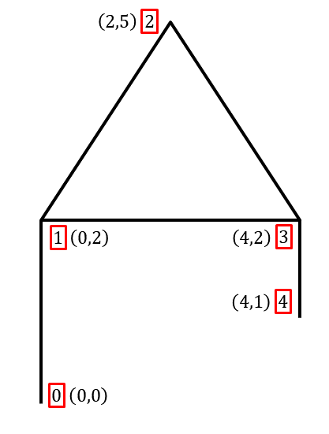
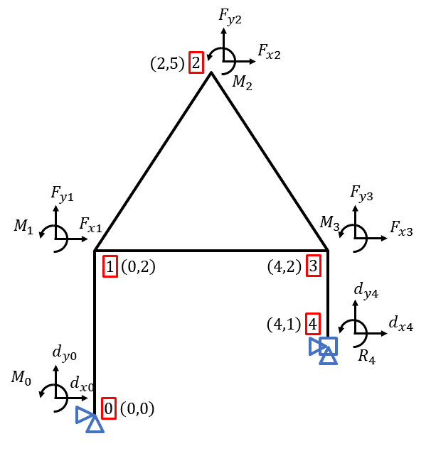
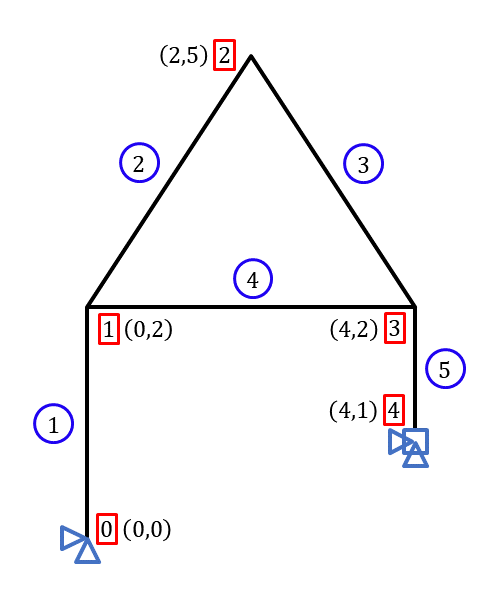
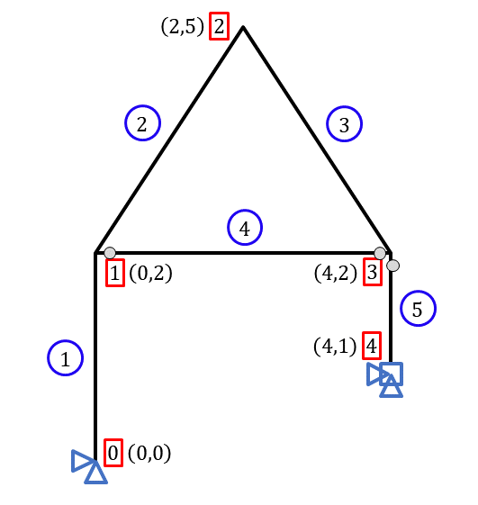
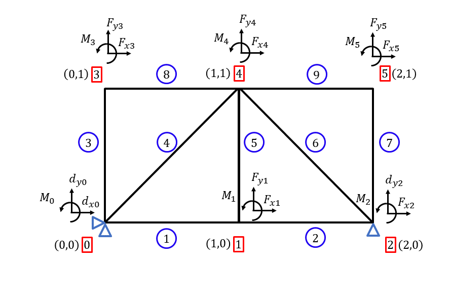

# Direct Stiffness Method 2D frame 

This program consist of solving 2D frames using the direct stiffness method.

## How to use the program - step by step:

1. Define the 'x' and 'y' coordinates of the frame (coord matrix):

    The first and the second rows of the coord matrix are, respectively, the 'x' and 'y' coordinates, in other words, the coord matrix must have only 2 rows.

    The number of columns of the coord matrix must be equal to the number of node of the frame. 

    ```bash
    coord = np.matrix([[0, 0, 2, 4, 4],
                        [0, 2, 5, 2, 1]])
    ```
<p align="center">
    
</p>


2. Define the support conditions (support matrix):

    Each node must have 3 degrees of freedon (dof), so the number of rows of the support matrix must be equal to 3 and the number of columns equal to the number of nodes of the frame.

    If the value is equal to 1, that dof is a support.

    ```bash
    support = np.matrix([[1, 0, 0, 0, 1],
                        [1, 0, 0, 0, 1],
                        [0, 0, 0, 0, 1]])
    ```


3. Matrix that indicates the nodal loads (load matrix):

    If the load position coincides with 1 in support matrix, it will correspond to a support displacement.
    
    It must have the same shape of support matrix.

    ```bash
    # Fx1 = 1, M2 = 20 and dx4 = 0.1. The rest is equal to 0.
    load = np.matrix([[0, 1, 0, 0, 0.1],
                    [0, 0, 0, 0, 0],
                    [0, 0, 20, 0, 0]])
    ```

<p align="center">
    
</p>


4. Incidence matrix (inc matrix):

    Indicates the inicial and the final node of each element.

    The number of columns is equal to the number of elements.

    ```bash
    inc = np.matrix([[0, 1, 2, 1, 3],
                    [1, 2, 3, 3, 4]])
    ```

<p align="center">
    
</p>


5. Matrix with the position of the hinges (hinge matrix):

    1 if the node is articulated in that element.

    ```bash
    hinge = np.matrix([[0, 0, 0, 1, 1],
                        [0, 0, 0, 1, 0]])
    ```

<p align="center">
    
</p>


6. Stiffness of each element (EA and EJ):

    Stiffness of each frame element.

    ```bash
    EA = np.matrix([1,1,1,1,1])*50
    EJ = np.matrix([1,1,1,1,1])*60
    ```


After all these steps, this program is ready to calculate the displacements in each node, the normal forces, shear forces and bending moments in each element.

## Another example
1. Coordinate matrix:

    ```bash
    coord = np.matrix([[0, 1, 2, 0, 1, 2],
                        [0, 0, 0, 1, 1, 1]])
    ```
2. Support matrix:

    ```bash
    support = np.matrix([[1, 0, 0, 0, 0, 0],
                            [1, 0, 1, 0, 0, 0],
                            [0, 0, 0, 0, 0, 0]])
    ```
3. Load matrix:

    ```bash
    # Fy4 = -5
    load = np.matrix([[0, 0, 0, 0, 0, 0],
                        [0, 0, 0, 0, -5, 0],
                        [0, 0, 0, 0, 0, 0]])
    ```
4. Incidence matrix:

    ```bash
    inc = np.matrix([[0, 1, 0, 0, 1, 2, 2, 3, 4],
                    [1, 2, 3, 4, 4, 4, 5, 4, 5]])
    ```
5. Hinge matrix:

    ```bash
    hinge = np.matrix([[0, 0, 0, 0, 0, 0, 0, 0, 0],
                    [0, 0, 0, 0, 0, 0, 0, 0, 0]])
    ```
6. Stiffness for each element:

    ```bash
    EA = np.matrix([1,1,1,1,1,1,1,1,1])*50
    EJ = np.matrix([1,1,1,1,1,1,1,1,1])*60
    ```

<p align="center">
    
</p>

Made by Osmar Alexandre. See my [LinkedIn](https://www.linkedin.com/in/osmaralexandre/)